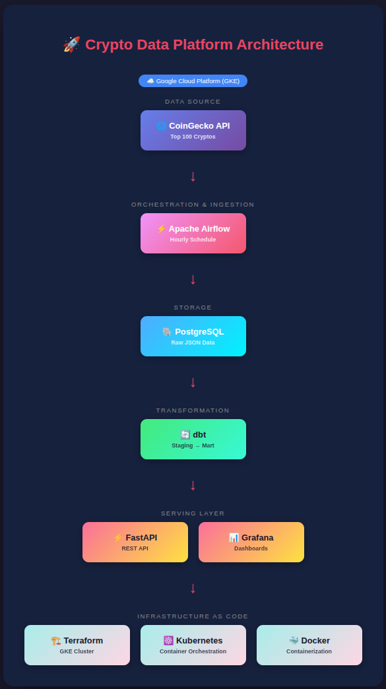
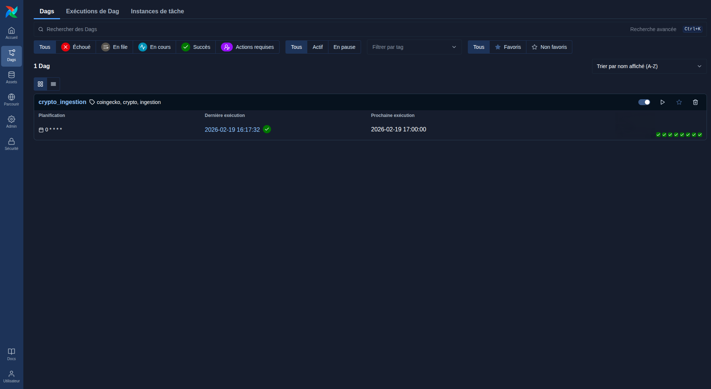
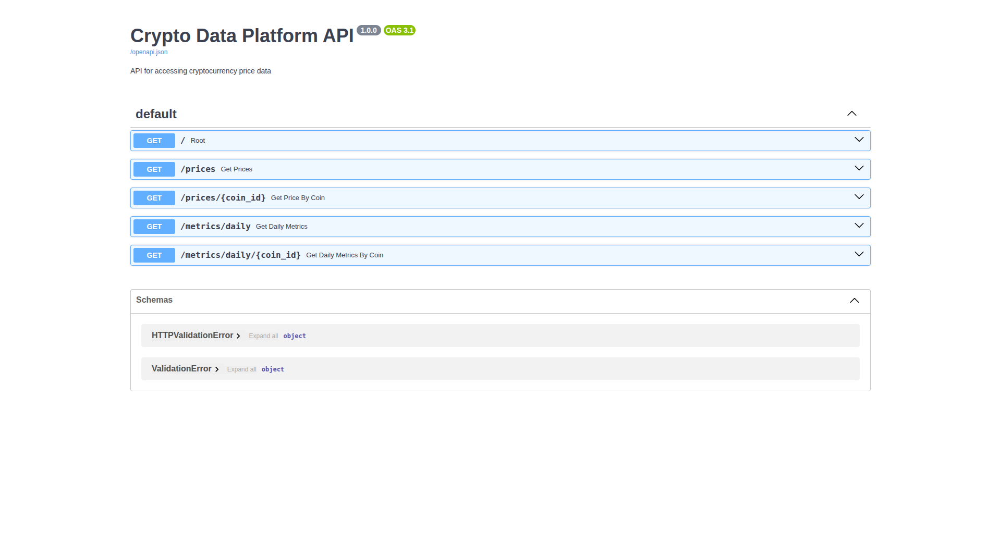
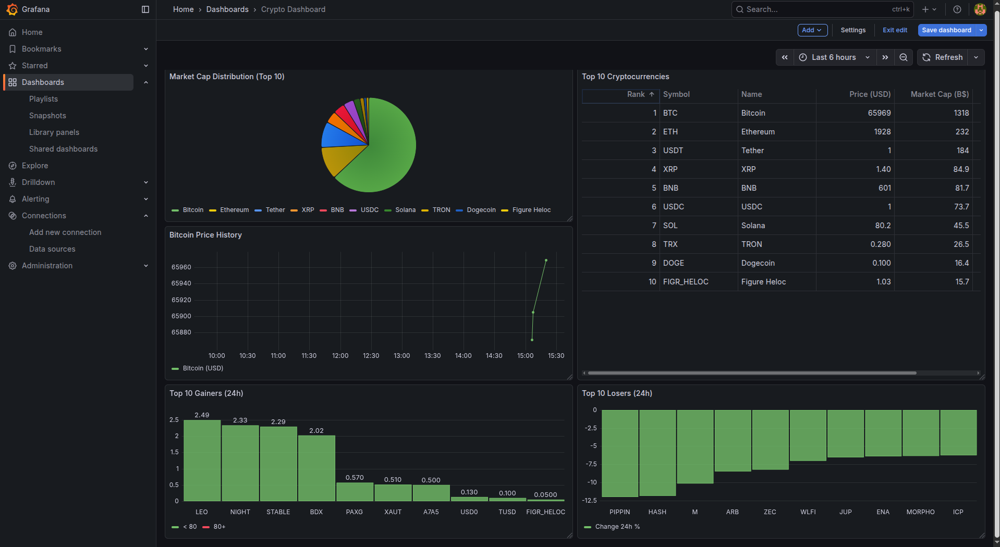
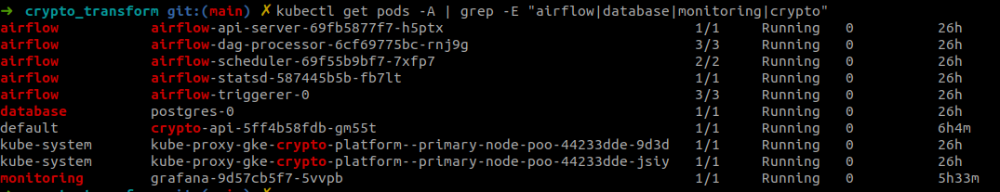

# Crypto Data Platform

A production-grade data platform for cryptocurrency market data, demonstrating modern data engineering practices.

## 🎯 Project Overview

This project builds a complete data platform that ingests, transforms, and serves cryptocurrency market data. It showcases skills in data engineering, platform engineering, and cloud infrastructure.



## 📊 Data Sources

- **CoinGecko API** (Free tier) - `/coins/markets` endpoint
  - Top 100 cryptocurrencies by market cap (hourly ingestion)
  - Price (USD), market cap, 24h volume, 24h change
  - High/low 24h, circulating supply, total supply

## 🛠️ Tech Stack

### Data Engineering
| Tool                   | Purpose                |
|------------------------|------------------------|
| **Apache Airflow**     | Workflow orchestration |
| **dbt**                | Data transformation    |
| **PostgreSQL**         | Data warehouse         |

### Infrastructure
| Tool                     | Purpose                 |
|--------------------------|-------------------------|
| **Docker**               | Containerization        |
| **Kubernetes (K3d/GKE)** | Container orchestration |
| **ArgoCD**               | GitOps deployment (local) |
| **Terraform**            | Infrastructure as Code  |

### Serving Layer
| Tool          | Purpose               |
|---------------|-----------------------|
| **FastAPI**   | REST API              |
| **Grafana**   | Dashboards & monitoring |

### Languages
- Python
- SQL
- YAML
- Bash
- HCL (Terraform)

## 🚀 Project Phases

### Phase 1: Batch Pipeline (Local) ✅ Done
- [x] Project setup and documentation
- [x] K3d cluster + ArgoCD
- [x] PostgreSQL deployment
- [x] Data ingestion from CoinGecko (Airflow DAG)
- [x] dbt transformations (staging + mart layers)
- [x] Airflow orchestration (git-sync + KubernetesExecutor)
- [x] FastAPI serving layer

### Phase 2: Streaming + Quality 📋 Planned
- [ ] Apache Kafka deployment
- [ ] Real-time price streaming
- [ ] Great Expectations integration
- [ ] Streamlit dashboard

### Phase 3: Cloud Migration ✅ Done
- [x] Terraform GCP infrastructure
- [x] GKE manifests (postgres + API + Airflow + Grafana)
- [x] Full GKE production deployment
- [ ] GitHub Actions CI/CD

## 📁 Project Structure
```
sanaggar-crypto-data-platform/
│
├── README.md
├── docs/
│   ├── architecture.md
│   ├── setup.md
│   ├── adr/                          # Architecture Decision Records
│   └── images/                       # Architecture & screenshots
│
├── api/                               # FastAPI REST service
│   ├── Dockerfile
│   ├── main.py
│   └── requirements.txt
│
├── dags/                              # Airflow DAG definitions
│   └── crypto_ingestion.py
│
├── dbt/crypto_transform/              # dbt data transformation
│   ├── dbt_project.yml
│   ├── profiles.yml.example          # dbt profile template
│   └── models/
│       ├── staging/
│       │   ├── stg_prices.sql
│       │   ├── stg_prices.yml
│       │   └── sources.yml
│       └── mart/
│           ├── daily_metrics.sql
│           └── daily_metrics.yml
│
├── manifests/
│   ├── base/                          # Local K3d cluster
│   │   ├── argocd/
│   │   │   └── ingress.yaml
│   │   ├── postgres/
│   │   │   ├── namespace.yaml
│   │   │   ├── pvc.yaml
│   │   │   ├── statefulset.yaml
│   │   │   ├── service.yaml
│   │   │   └── secret.yaml.example
│   │   ├── airflow/
│   │   │   ├── values.yaml
│   │   │   ├── secret.yaml.example
│   │   │   ├── webserver-secret.yaml.example
│   │   │   └── git-secret.yaml.example
│   │   ├── api/
│   │   │   ├── deployment.yaml
│   │   │   ├── service.yaml
│   │   │   └── secret.yaml.example
│   │   └── test-app/
│   │       ├── deployment.yaml
│   │       └── service.yaml
│   └── gke/                           # Google Kubernetes Engine
│       ├── postgres/
│       │   ├── pvc.yaml
│       │   ├── statefulset.yaml
│       │   └── secret.yaml.example
│       └── api/
│           ├── deployment.yaml
│           ├── service.yaml
│           └── secret.yaml.example
│
├── scripts/                           # Automated installation
│   ├── install-local.sh              # One-click local setup (K3d)
│   └── install-gke.sh               # GKE cloud deployment
│
├── .env.example                       # Environment variables template
│
└── terraform/                         # GCP Infrastructure as Code
    ├── main.tf
    ├── gke.tf
    └── terraform.tfvars
```

## 🏃 Quick Start

### Prerequisites
- Docker
- kubectl
- K3d
- Helm
- dbt-postgres (`pip install dbt-postgres`)

### Automated Installation (Recommended)

The fastest way to get started. A single script handles everything: cluster creation, secrets, database setup, migrations, deployments, and dbt transformations.

```bash
# Clone the repository
git clone https://github.com/sanaggar/sanaggar-crypto-data-platform.git
cd sanaggar-crypto-data-platform

# Configure your environment
cp .env.example .env
nano .env  # Fill in the required passwords (GitHub token is optional)

# Run the installation
chmod +x scripts/install-local.sh
./scripts/install-local.sh
```

The script will:
1. Check prerequisites (Docker, kubectl, K3d, Helm)
2. Create a K3d cluster
3. Generate all Kubernetes secrets from your `.env`
4. Deploy PostgreSQL and initialize schemas (`raw`, `staging`, `mart`)
5. Run Airflow database migrations (core + FAB auth)
6. Deploy Airflow (with git-sync if GitHub token is provided, otherwise copies local DAGs)
7. Create the Airflow admin user and PostgreSQL connection
8. Build and deploy the FastAPI service
9. Deploy Grafana for monitoring
10. Generate `~/.dbt/profiles.yml` and run dbt transformations

Once complete, access your services:
```bash
# Airflow UI
kubectl port-forward svc/airflow-api-server 8080:8080 -n airflow
# -> http://localhost:8080 (user: admin / password: from .env)

# API (Swagger docs)
kubectl port-forward svc/crypto-api 8001:8000
# -> http://localhost:8001/docs

# Grafana
kubectl port-forward svc/grafana 3000:80 -n monitoring
# -> http://localhost:3000 (user: admin / password: from .env)
```

<details>
<summary><b>Manual Installation (Step by Step)</b></summary>

### 1. Clone and Setup Cluster
```bash
git clone https://github.com/sanaggar/sanaggar-crypto-data-platform.git
cd sanaggar-crypto-data-platform

k3d cluster create crypto-platform \
  --servers 1 \
  --agents 2 \
  --port "8081:80@loadbalancer" \
  --port "8443:443@loadbalancer" \
  --port "5432:5432@loadbalancer"
```

### 2. Install ArgoCD
```bash
kubectl create namespace argocd
kubectl apply -n argocd -f https://raw.githubusercontent.com/argoproj/argo-cd/stable/manifests/install.yaml

# Configure ArgoCD for HTTP (dev only)
kubectl edit configmap argocd-cmd-params-cm -n argocd
# Add under data:
#   server.insecure: "true"

kubectl rollout restart deployment argocd-server -n argocd
kubectl apply -f manifests/base/argocd/ingress.yaml

# Get admin password
kubectl -n argocd get secret argocd-initial-admin-secret -o jsonpath="{.data.password}" | base64 -d
```

Access ArgoCD at: http://localhost:8081

### 3. Configure Secrets

**Secrets are NOT stored in Git. You must create them from the `.example` templates.**

```bash
# PostgreSQL
cp manifests/base/postgres/secret.yaml.example manifests/base/postgres/secret.yaml

# Airflow
cp manifests/base/airflow/secret.yaml.example manifests/base/airflow/secret.yaml
cp manifests/base/airflow/webserver-secret.yaml.example manifests/base/airflow/webserver-secret.yaml
cp manifests/base/airflow/git-secret.yaml.example manifests/base/airflow/git-secret.yaml

# API
cp manifests/base/api/secret.yaml.example manifests/base/api/secret.yaml

# Edit each file with your credentials
```

### 4. Deploy PostgreSQL
```bash
kubectl create namespace database
kubectl apply -f manifests/base/postgres/secret.yaml

argocd repo add https://github.com/sanaggar/sanaggar-crypto-data-platform.git \
  --username YOUR_GITHUB_USERNAME \
  --password YOUR_GITHUB_TOKEN

argocd app create postgres \
  --repo https://github.com/sanaggar/sanaggar-crypto-data-platform.git \
  --path manifests/base/postgres \
  --dest-server https://kubernetes.default.svc \
  --dest-namespace database \
  --sync-policy automated
```

### 5. Setup PostgreSQL Schemas
```bash
kubectl exec -it postgres-0 -n database -- psql -U YOUR_USER -d crypto_data

CREATE SCHEMA raw;
CREATE SCHEMA staging;
CREATE SCHEMA mart;
CREATE DATABASE airflow_metadata;
\q
```

### 6. Deploy Airflow
```bash
kubectl create namespace airflow
kubectl apply -f manifests/base/airflow/secret.yaml
kubectl apply -f manifests/base/airflow/webserver-secret.yaml
kubectl apply -f manifests/base/airflow/git-secret.yaml

helm repo add apache-airflow https://airflow.apache.org
helm repo update

helm install airflow apache-airflow/airflow \
  --namespace airflow \
  --values manifests/base/airflow/values.yaml \
  --timeout 15m
```

### 7. Setup dbt
```bash
cp dbt/crypto_transform/profiles/profiles.yml.example dbt/crypto_transform/profiles/profiles.yml
nano dbt/crypto_transform/profiles/profiles.yml

kubectl port-forward svc/postgres 5432:5432 -n database
cd dbt/crypto_transform && dbt run
```

### 8. Deploy FastAPI
```bash
docker build -t crypto-api:latest api/
k3d image import crypto-api:latest -c crypto-platform

kubectl apply -f manifests/base/api/secret.yaml
kubectl apply -f manifests/base/api/deployment.yaml
kubectl apply -f manifests/base/api/service.yaml
```

</details>

## 🔐 Security Notes

- **Never commit secrets to Git** - All sensitive files are in `.gitignore`
- **Use `.example` files as templates** - Copy and fill with your own values
- **Rotate credentials regularly** - Especially before making repo public
- **Use strong passwords** - Mix of uppercase, lowercase, numbers, and symbols

## 📸 Screenshots

| Airflow DAG | FastAPI Swagger |
|:-----------:|:---------------:|
|  |  |

| Grafana Dashboard | Kubernetes Pods |
|:-----------------:|:---------------:|
|  |  |

## 📚 Documentation

- [Architecture Overview](docs/architecture.md)
- [Setup Guide](docs/setup.md)
- [Architecture Decision Records](docs/adr/)

## 🎓 Skills Demonstrated

This project demonstrates proficiency in:

- **Data Engineering**: ETL/ELT pipelines, batch processing
- **Platform Engineering**: Kubernetes, GitOps, containerization
- **Cloud Engineering**: IaC with Terraform, GCP services
- **DevOps**: CI/CD, monitoring, observability
- **Software Engineering**: API design, testing, documentation
- **Security**: Secret management, credential handling

## 👤 Author

**sanaggar**
